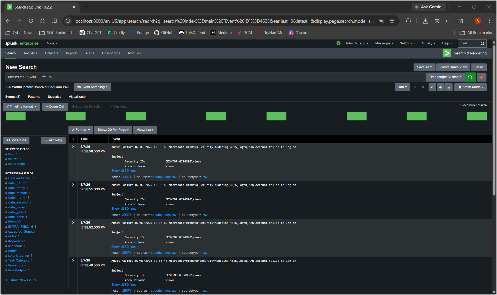
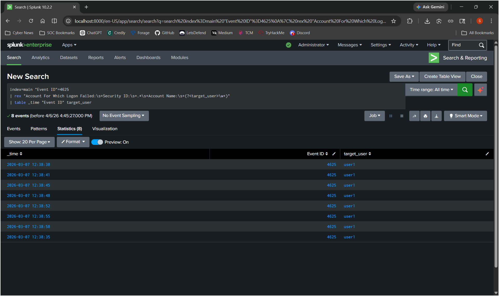
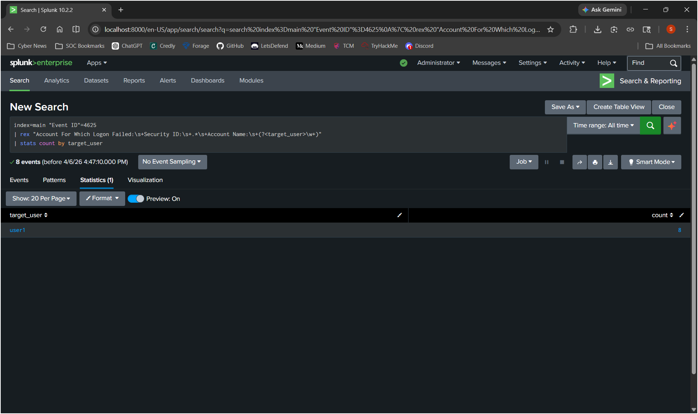
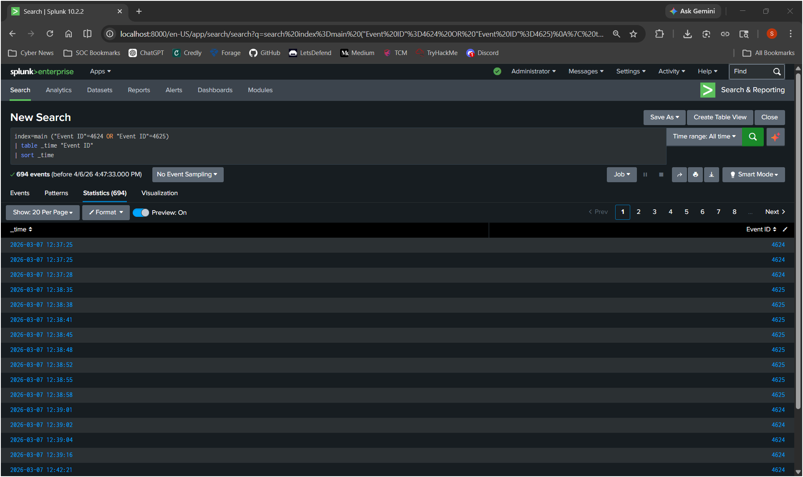
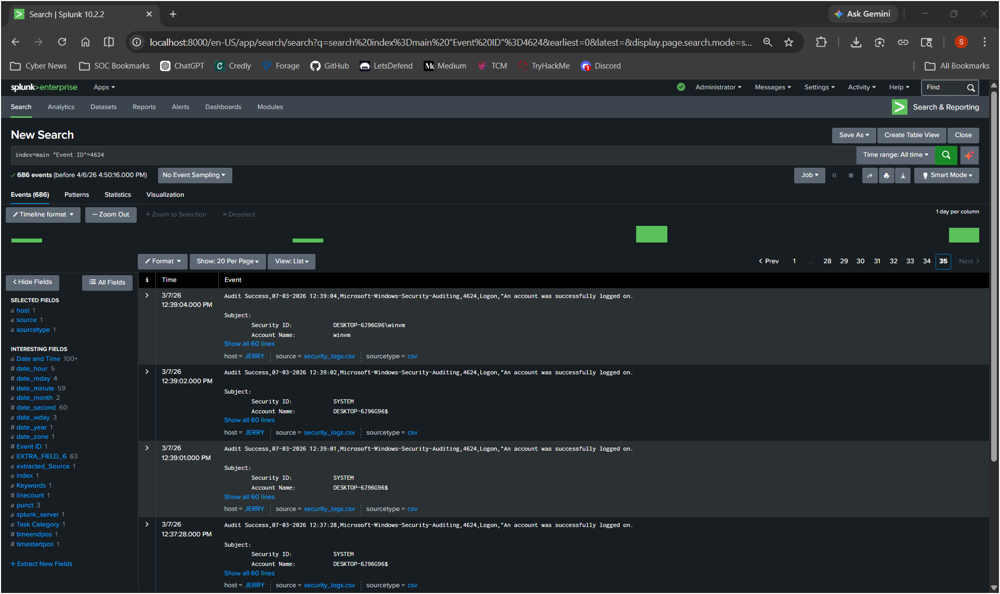
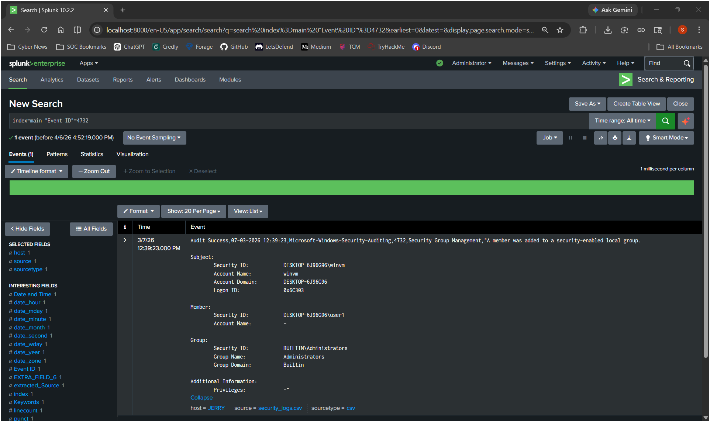

# Threat Hunting & Incident Analysis: Brute Force Attack Detection using Splunk

## Overview

This project demonstrates a threat hunting investigation using Splunk to detect a multi-stage attack involving brute-force login attempts, credential compromise, and privilege escalation.

The analysis is based on Windows Security Event Logs (Event IDs 4625, 4624, and 4732) and follows a real-world SOC investigation workflow—from initial detection to attack chain reconstruction.

---

## Objective

- Detect brute-force login attempts  
- Identify the targeted user account  
- Correlate failed and successful login events  
- Detect privilege escalation activity  
- Reconstruct the full attack timeline  

---

## Tools Used

- Splunk Enterprise  
- Windows Security Event Logs  
- SPL (Search Processing Language)  

---

## Investigation Approach

A hypothesis-driven approach was used:

> An attacker may be attempting multiple password guesses (brute force), eventually gaining access and escalating privileges.

---

## Investigation Steps

### 1. Detect Failed Login Attempts (Event ID 4625)

**Query:**
```spl
index=main "Event ID"=4625
````

**Screenshot:**


**Analysis:**
Multiple failed login attempts were observed within a short time window, indicating potential brute-force activity.

---

### 2. Identify Targeted User

**Query:**

```spl
index=main "Event ID"=4625
| rex "Account For Which Logon Failed:\s+Security ID:\s+.*\s+Account Name:\s+(?<target_user>\w+)"
| table _time "Event ID" target_user
```

**Screenshot:**


**Analysis:**
The targeted account extracted from logs is **user1**, identifying the account under attack.

---

### 3. Quantify the Attack

**Query:**

```spl
index=main "Event ID"=4625
| rex "Account For Which Logon Failed:\s+Security ID:\s+.*\s+Account Name:\s+(?<target_user>\w+)"
| stats count by target_user
```

**Screenshot:**


**Analysis:**
A total of 8 failed login attempts were recorded against user1, confirming a brute-force pattern.

---

### 4. Correlate Attack Timeline

**Query:**

```spl
index=main ("Event ID"=4624 OR "Event ID"=4625)
| table _time "Event ID"
| sort _time
```

**Screenshot:**


**Analysis:**
The timeline shows multiple failed login attempts followed by a successful login event.

**Insight:**
This sequence strongly suggests that the attacker successfully guessed valid credentials.

---

### 5. Confirm Successful Login (Event ID 4624)

**Query:**

```spl
index=main "Event ID"=4624
```

**Screenshot:**


**Analysis:**
A successful login confirms that the attacker gained access to the account.

---

### 6. Detect Privilege Escalation (Event ID 4732)

**Query:**

```spl
index=main "Event ID"=4732
```

**Screenshot:**


**Analysis:**
The compromised account (user1) was added to the Administrators group, indicating privilege escalation.

---

## Detection Logic

```
IF multiple failed login attempts (4625)
AND followed by successful login (4624)
THEN possible credential compromise

IF compromised account modifies group membership (4732)
THEN privilege escalation detected
```

---

## Incident Summary

1. Multiple failed login attempts (Event ID 4625) detected
2. Target account identified as **user1**
3. 8 failed attempts confirm brute-force behavior
4. Successful login (Event ID 4624) indicates account compromise
5. Privilege escalation (Event ID 4732) confirms administrative access

---

## MITRE ATT&CK Mapping

| Technique | Description          |
| --------- | -------------------- |
| T1110     | Brute Force          |
| T1078     | Valid Accounts       |
| T1068     | Privilege Escalation |

---

## Real-World Impact

If this activity is not detected:

* Unauthorized access to systems
* Privilege escalation to administrator level
* Potential full system compromise

---

## Conclusion

This investigation demonstrates how Windows authentication logs can be analyzed using Splunk to detect a complete attack chain.

By correlating failed login attempts, successful authentication, and privilege escalation events, it is possible to identify attacker behavior and reconstruct the incident.

This workflow reflects real-world SOC practices for threat detection and incident response.

---

## Project Files

- [Incident Report](analysis/incident_report.md)
- [Splunk Queries](queries/splunk_queries.md)
